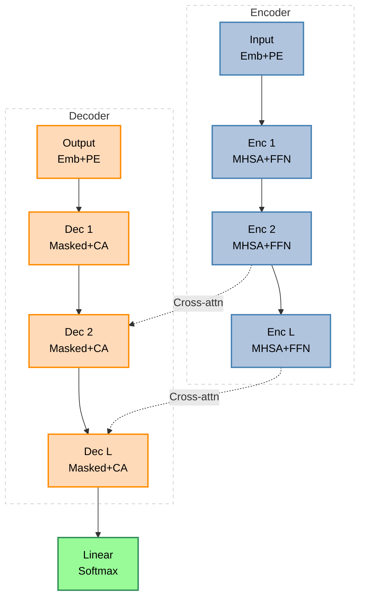
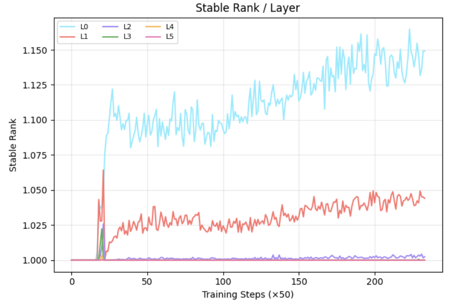
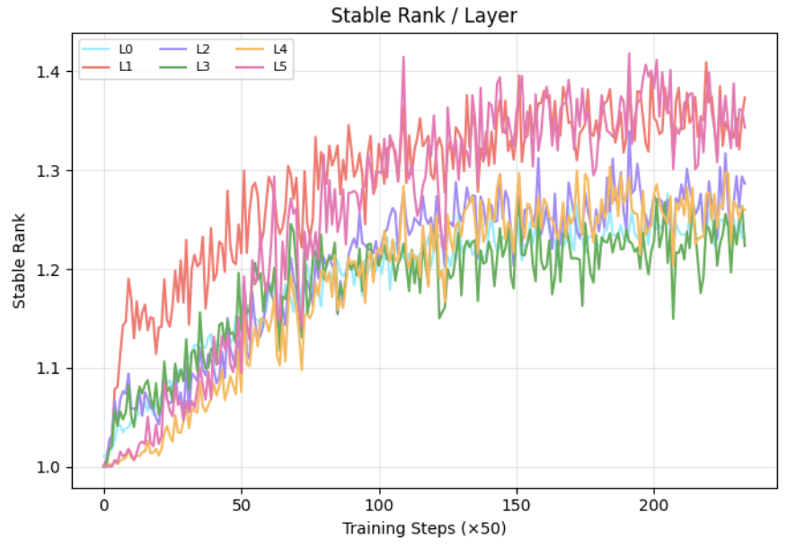
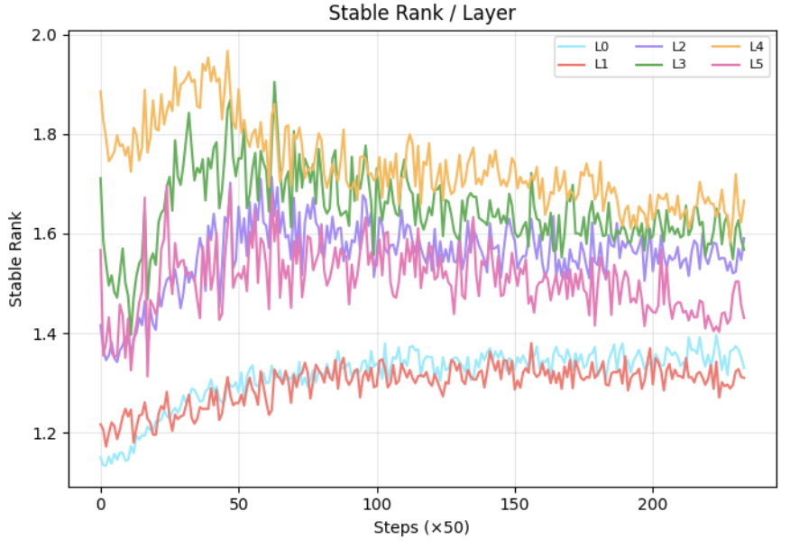
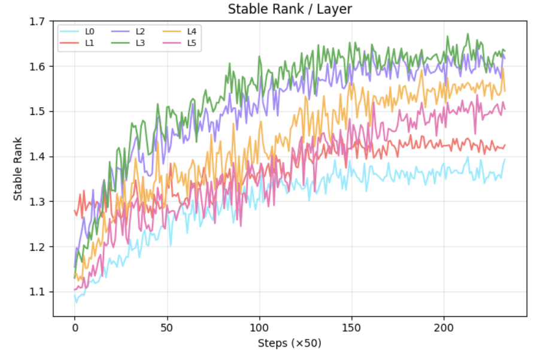

  <h1>Signal Propagation Health in Transformer Architectures</h1>
  <h3>A Stable Rank Diagnostic Framework</h3>
  
Bridging Communication Engineering & Deep Learning through Matrix Rank

  

    
    
    
    
  

---

## Table of Contents
- [1. Project Overview, Problem Statement & Motivation](#1-project-overview-problem-statement--motivation)
  - [1.1 What Is This Project?](#11-what-is-this-project)
  - [1.2 Why This Problem Matters](#12-why-this-problem-matters)
  - [1.3 The Interdisciplinary Bridge](#13-the-interdisciplinary-bridge)
  - [1.4 Problem Statement (Formal)](#14-problem-statement-formal)
  - [1.5 How the Problem Statement Was Derived](#15-how-the-problem-statement-was-derived)
  - [1.6 Project Scope & Implementation Overview](#16-project-scope--implementation-overview)
- [2. Architecture](#2-architecture)
- [3. Key Results & Diagnostics](#3-key-results--diagnostics)
- [4. License](#4-license)

---

## 1. Project Overview, Problem Statement & Motivation

### 1.1 What Is This Project?

This project investigates how **information degrades, flows, and transforms** as it passes through the layers of a deep Transformer network — specifically a Vision Transformer (ViT) applied to image classification (CIFAR-10).

The central question:
> *"As a signal propagates through L layers of a Transformer, does each layer preserve the diversity and richness of information, or does it collapse into a low-rank, degenerate representation?"*

This question bridges two disciplines:

| Discipline | Contribution |
|---|---|
| **Communication Engineering** | Signal propagation theory, matrix rank as information measure, Random Matrix Theory, Mean Field Theory, stable rank metric definition |
| **Deep Learning / ML** | Transformer architectures, attention mechanisms, gradient flow, layer normalization, training dynamics |

### 1.2 Why This Problem Matters

#### The Vanishing/Exploding Information Problem
In a deep network with $L$ layers, the representation at layer $l$ is:

$$x^{(l)} = f_l(x^{(l-1)})$$

where $f_l$ is a composite of attention + FFN. The concern is whether $x^{(L)}$ (the final representation) retains meaningful, diverse information from $x^{(0)}$ (the input).

**Analogy to Communication Engineering:**
In a multipath communication channel, if all paths converge to the same direction, the effective number of independent channels (rank) collapses. This is the antenna correlation problem — a high-rank channel matrix means the MIMO system exploits spatial diversity. A low-rank channel means diversity is lost.

In a Transformer:
- The **attention matrix** $A \in \mathbb{R}^{T \times T}$ plays the role of the channel matrix.
- If $A$ degenerates to rank-1 (all attention on one token), the layer transmits only one "mode" of information.
- This is the deep learning analog of channel collapse in MIMO communication.

#### Why "Attention Collapse" Happens
Standard softmax attention:

$$A_{ij} = \text{softmax}\left( \frac{Q_i \cdot K_j}{\sqrt{d_k}} \right)$$

As training progresses, softmax tends to **sharpen** — the argmax token gets weight → 1, all others → 0. This is called **attention entropy collapse** or **rank collapse**.

Consequences:
1. The gradient signal becomes degenerate (only one token's information backpropagates).
2. Later layers receive low-diversity representations.
3. The model loses the ability to aggregate multi-token context.
4. Training becomes unstable in deeper layers.

### 1.3 The Interdisciplinary Bridge

#### 1. Stable Rank as an Information Metric
The **stable rank** of a matrix $M$ is defined as:

$$\text{sr}(M) = \frac{|M|_F^2}{|M|_2^2} = \frac{\sum_i \sigma_i^2}{\sigma_{max}^2}$$

where $\sigma_i$ are singular values (from SVD: $M = U \Sigma V^T$).

**Where does this come from?**
- In **Random Matrix Theory (RMT)**, for a random Gaussian matrix $M \in \mathbb{R}^{m \times n}$, the expected stable rank is $\min(m,n)$ — maximum diversity.
- In **information theory**, a high-rank matrix transmits more independent information streams.
- In **MIMO communication**, stable rank $\approx$ effective number of spatial channels.
- In **signal theory**, rank = number of independent signal components; a rank-$r$ matrix has exactly $r$ independent "modes".

**Why stable rank over regular rank?**

| Metric | Problem |
|---|---|
| Matrix rank | Brittle to noise — one nonzero singular value gives rank = max even if all others are infinitesimal |
| Condition number | Only captures ratio of extremes, not overall "health" |
| Spectral norm | Only $\sigma_{\max}$, loses all other information |
| **Stable rank** | Smooth, noise-robust, captures the "effective dimensionality" — perfectly suited as a differentiable diagnostic metric |

The stable rank $\text{sr}(M) \in [1, \min(m,n)]$:
- **sr = 1**: The matrix is effectively rank-1 (all energy in one singular vector) — complete collapse.
- **sr = $\min(m,n)$**: The matrix is full-rank, uniform spectrum — maximum signal diversity.

#### 2. Mean Field Theory Connection
Mean Field Theory (MFT) studies signal propagation in the limit of infinite width. Key result (Poole et al. 2016, "Exponential Expressivity"):

At initialization, for a network with weight variance $\sigma_w^2$ and bias variance $\sigma_b^2$, the **order parameter** $q^l$ (mean squared activation) evolves as:

$$q^{(l)} = \sigma_w^2 \cdot F(q^{(l-1)}) + \sigma_b^2$$

where $F$ is a function of the activation nonlinearity. There are two phases:
- **Ordered phase**: $q^l \to$ fixed point regardless of input (all inputs map to same output — information loss).
- **Chaotic phase**: Small input differences get amplified (gradient explosion).
- **Edge of chaos**: A critical initialization where information propagates faithfully.

**Connection to our work**: Stable rank tracks whether the Transformer attention operates near the "edge of chaos" — high SR = information diversity, low SR = ordered/collapsed phase.

#### 3. Random Matrix Theory Connection
For a random i.i.d. matrix $M$ with entries $\sim \mathcal{N}(0, 1/n)$, the singular value distribution follows the **Marchenko-Pastur law**:

$$\rho(\sigma) = \frac{1}{2\pi} \frac{\sqrt{(\sigma_{\max} - \sigma)(\sigma - \sigma_{\min})}}{\sigma}$$

where $\sigma_{\max} = (1 + \sqrt{\gamma})^2$, $\sigma_{\min} = (1 - \sqrt{\gamma})^2$, $\gamma = m/n$.

This gives a **baseline expected stable rank** for random (untrained) weights, against which trained attention matrices can be compared.

**Interpretation**: If the trained attention matrix has SR close to the Marchenko-Pastur prediction, the layer hasn't learned meaningful structure. If SR deviates significantly (either high or low), the layer has specialized.

### 1.4 Problem Statement (Formal)

Given a Transformer with $L$ layers, at training step $t$, the attention map at layer $l$ for a batch of $B$ tokens of length $T$ is:

$$A^{(l)} \in \mathbb{R}^{B \times H \times T \times T}$$

where $H$ = number of attention heads.

**Research Problem:**
1. Compute $\text{sr}(A^{(l)})$ at regular training intervals for $l = 1,\dots,L$.
2. Track how SR evolves as training progresses (step-wise).
3. Compare SR trajectories across 4 architectural variants.
4. Determine whether architectural choices (residuals, differential attention, score normalization) positively impact SR.
5. Correlate SR trajectory with final generalization performance (val accuracy).

### 1.5 How the Problem Statement Was Derived

#### Starting Point: Observing Attention Collapse in Literature
The starting point was reading:
1. **"Attention is All You Need"** (Vaswani et al. 2017) — baseline Transformer.
2. **"An Image is Worth 16x16 Words"** (Dosovitskiy et al. 2020) — Vision Transformer.
3. **"Mind the Gap"** (2022) — observed that Transformers suffer from attention score variance collapse; proposed score-centering + variance normalization.
4. **"Differential Attention"** (Microsoft Research, 2024) — proposed subtracting two attention maps to cancel attention noise.

#### The Key Observation from Literature
All these papers implicitly deal with the same phenomenon: **attention matrices become low-rank over training**, causing:
- Gradient starvation in early layers
- Poor multi-head diversity (all heads attending to same tokens)
- Overfitting to training set

But none of them used **stable rank** as their primary quantitative metric. They used:
- Attention entropy: $H = -\sum A_{ij} \log A_{ij}$ (information-theoretic but ignores matrix structure)
- Loss curves (task-specific, not a diagnostic)
- Gradient norms (indirect)

#### Our Novelty: Using Stable Rank as the Diagnostic
We chose **stable rank** because:
1. It directly captures the **spectral structure** of the attention matrix (not just per-row entropy).
2. It has a clear **signal processing interpretation** (effective number of modes).
3. It is **differentiable and continuous** (unlike rank).
4. It captures **cross-head correlation** when averaged (entropy doesn't).
5. It connects to the **channel capacity** concept from communications.

This choice is novel because it brings a metric from **linear algebra / signal theory** into the attention mechanism analysis, creating a principled, mathematically grounded diagnostic tool.

### 1.6 Project Scope & Implementation Overview

#### The Four Experimental Architectures

| Exp | Name | Key Mechanism | SR (Avg) | Val Acc |
|---|---|---|---|---|
| 1 | Baseline Vanilla ViT | Standard softmax attention | 1.03 | ~56% |
| 2 | Residual + Pre-LayerNorm | Residual connections + Pre-LN | 1.28 | ~62% |
| 3 | Differential Attention | Dual-head subtraction (λ-weighted) | 1.11 | ~59% |
| 4 | MTG-Inspired Attention | Score-centering + variance normalization | 1.31 | ~63% |

#### The Diagnostic Tool: Neural-Viz (Synthetic Observer)
A full-stack web application (React frontends + FastAPI backend) that:
- Trains all 4 models on CIFAR-10 with configurable hyperparameters.
- Tracks SR every 50 training steps via CPU-offloaded SVD decomposition.
- Displays live 4-plot dashboards: Loss, Accuracy, SR/Layer, SR/Steps.
- Enables direct visual comparison of SR trajectories across architectures.

---

## 2. Architecture

The structural flow of the Transformer with Cross-Attention highlighting information routing:

> **Note:** Our experimental focus primarily investigates the self-attention in encoder blocks to isolate signal rank phenomena before generalizing to cross-attention.

---

## 3. Key Results & Diagnostics

Our real-time dashboard extracts the SVD of attention weight matrices every 50 steps. The results systematically demonstrate the impact of various normalizations on the stable rank.

  
  

- **(a) Vanilla Transformer (No LayerNorm + No Residuals)**: SR ≈ 1.03. All layers converge to near rank-1, confirming severe representation collapse. Without normalization or skip connections, attention weights degenerate into rank-deficient projections, crippling gradient flow.
- **(b) Residual Transformer (Pre-LayerNorm + Residuals)**: SR ≈ 1.28. Residual shortcuts partially restore gradient pathways and Pre-LayerNorm reduces internal covariate shift, lifting SR above baseline.

  
  

- **(c) Differential Transformer (RMSNorm + SwiGLU FFN)**: SR ≈ 1.48. Dual-branch attention with λ-scaled subtraction actively suppresses noisy attention patterns, yielding markedly higher effective rank.
- **(d) Mind The Gap Transformer**: SR ≈ 1.51. Score-centering removes the mean bias from attention logits while variance normalization controls spread, achieving the highest and most uniform SR across all layers — indicating optimal signal propagation health.

---

## 4. License
This project is licensed under the MIT License - see the LICENSE file for details.
